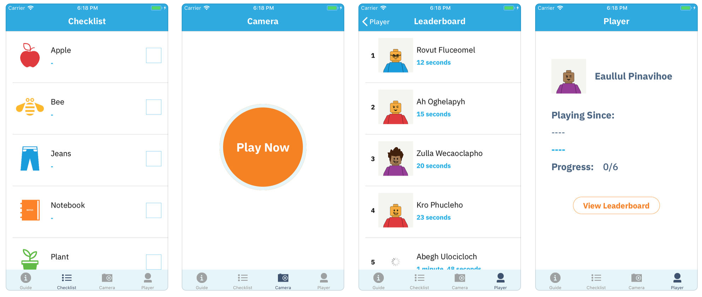

# Build an iOS game powered by Core ML and Watson Visual Recognition

This code pattern is an iOS timed game that has users find items based on a list of objects developed for Apple phones. It is built to showcase visual recognition with Core ML in a fun way. This project repository consists of an iOS app and a backend server. Both components are written in the Swift programming language and leverages the Kitura framework for the server side. Cloudant is also used to persist user records and best times, and Push Notifications are used to let a user know when they have been removed from the top of the leaderboard.

Our application has been published to the App Store under the name [WatsonML](https://itunes.apple.com/us/app/watsonml-visrec-game/id1387609935), and we encourage folks to give it a try. It comes with a built-in model for identifying six objects; shirts, jeans, apples, plants, notebooks, and lastly a plush bee. Our app could not have been built if not for fantastic pre-existing content from other IBMers. We use David Okun's Lumina project, and Anton McConville's Avatar generator microservice, see the references belwo for more information.

We include instruction on how to modify the application to fit your own needs. Feel free to fork the code and modify it to create your own conference swap game, scavenger hunt, guided tour, or team building or training event.

When the reader has completed this Code Pattern, they will understand how to:

* Create a custom visual recognition model in Watson Studio
* Develop an Swift based iOS application
* Deploy a Kitura based leaderboard
* Detect objects with Core ML and Lumina


## Flow

1. Generate a Core ML model using Watson Visual Recognition and Watson Studio.
2. User runs the iOS application for the first time.
3. The iOS application calls out to the Avatar microservice to generate a random username.
4. The iOS application makes a call to Cloudant to create a user record.
5. The iOS application notifies the Kitura service that the game has started.
6. The user aims the phone's camera as they search for items, using Core ML to identify them.
7. The user receives a push notification if they are bumped from the leaderboard.

## Included components
* [Core ML](https://developer.apple.com/documentation/coreml): Is a framework that will allow integration of machine learning models into apps.
* [Kitura](https://www.kitura.io/): Kitura is a free and open-source web framework written in Swift, developed by IBM and licensed under Apache 2.0. It’s an HTTP server and web framework for writing Swift server applications.
* [Watson Visual Recognition](https://www.ibm.com/watson/developercloud/visual-recognition.html): Visual Recognition understands the contents of images - visual concepts tag the image, find human faces, approximate age and gender, and find similar images in a collection.

## Featured technologies
* [Artificial Intelligence](https://medium.com/ibm-data-science-experience): Artificial intelligence can be applied to disparate solution spaces to deliver disruptive technologies.
* [Mobile](https://mobilefirstplatform.ibmcloud.com/): Systems of engagement are increasingly using mobile technology as the platform for delivery.

# Prerequisites

The following are prereqs to start developing the application

* Xcode
* IBM Cloud account
* [Carthage](https://github.com/Carthage/Carthage/releases): Download the latest release under `Downloads` select `Carthage.pkg` and install it.

# Steps

### To develop the iOS app

Clone the project

```
git clone https://github.com/IBM/rainbow/
```

Build the project by navigating to the `iOS` folder on your terminal, and typing:

```
carthage update --platform iOS
```

Create a folder called `Frameworks` in the `iOS` folder. Find the `Lumina.framework` and `VisualRecognitionV3.framework` from the `Carthage Build` folder, and move them to the `Frameworks` folder.

Open the `rainbow.xcodeproj` in XCode. Select the rainbow target, choose the General tab at the top, and scroll down to the Linked Frameworks and Libraries section at the bottom.

Drag and drop the `Frameworks` folder to the rainbow project - click `add groups` instead of add folder references. Navigate to the `embedded binaries` section of the rainbow project general information, and add the two frameworks as embedded binaries.

### To develop the server

1. Provision a Cloudant NoSQL DB instance
2. Provision a Push Notification instance
3. Deploy the app

More details to come!

# Build your own version!

1. Pick a theme and set of items -- museum pieces, office hardware, conference booths, whatever
2. Create a model in Watson Studio -- details to come
3. Replace the model at [iOS/rainbow/Model/ProjectRainbowModel_1753554316.mlmodel](iOS/rainbow/Model/ProjectRainbowModel_1753554316.mlmodel) 
4. Update the JSON file that lists the objects [iOS/rainbow/Config/GameObjects.json](iOS/rainbow/Config/GameObjects.json)
5. If you need icons check out [https://thenounproject.com/](https://thenounproject.com/)

More details to come!

# Sample output



# Links
* [Lumina](https://github.com/dokun1/Lumina): A camera designed in Swift for easily integrating CoreML models - as well as image streaming, QR/Barcode detection, and many other features.
* [IBM’s Watson Visual Recognition service to support Apple Core ML technology](https://developer.ibm.com/code/2018/03/21/ibm-watson-visual-recognition-service-to-support-apple-core-ml/): Blog from the code pattern author, Steve Martinelli.
* [Deploy a Core ML model with Watson Visual Recognition](https://developer.ibm.com/code/patterns/deploy-a-core-ml-model-with-watson-visual-recognition): code pattern shows you how to create a Core ML model using Watson Visual Recognition, which is then deployed into an iOS application.
* [AI Everywhere with IBM Watson and Apple Core ML](https://www.ibm.com/blogs/watson/2018/03/ai-everywhere-ibm-watson-apple-core-ml/): Blog from the code pattern author, Sridhar Sudarsan.
* [Watson Studio Tooling](https://dataplatform.ibm.com/registration/tepone?target=watson_vision_combined&context=wdp&apps=watson_studio/): Start creating your own Watson Visual Recognition classifier.

# Learn more
* **Artificial Intelligence Code Patterns**: Enjoyed this Code Pattern? Check out our other [AI Code Patterns](https://developer.ibm.com/code/technologies/artificial-intelligence/).
* **AI and Data Code Pattern Playlist**: Bookmark our [playlist](https://www.youtube.com/playlist?list=PLzUbsvIyrNfknNewObx5N7uGZ5FKH0Fde) with all of our Code Pattern videos

# License
[Apache 2.0](LICENSE)
